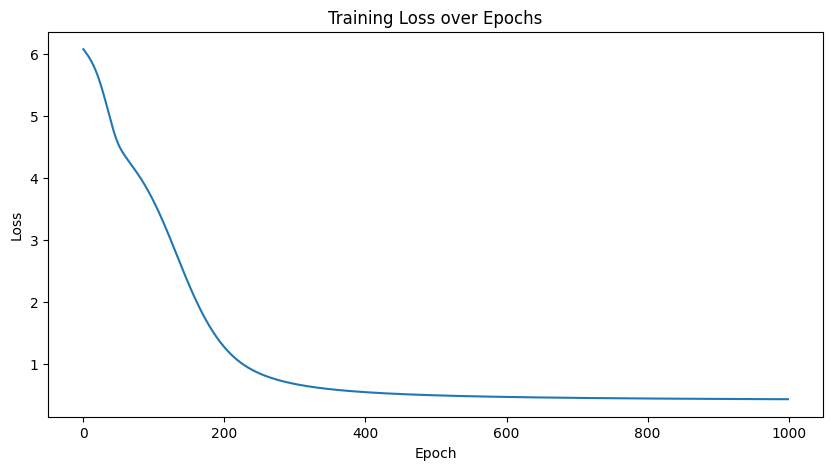

# Word2Vec Training with PyTorch

A from-scratch implementation of the **Continuous Bag of Words (CBOW)** Word2Vec model using PyTorch, built as part of CS 614 - Applications of Machine Learning.

## Overview

This project implements the Word2Vec CBOW architecture following the approach from the [original paper](https://arxiv.org/abs/1301.3781). Given a set of context words within a sliding window, the model learns to predict the target (center) word. Through this training process, the model produces dense vector embeddings that capture semantic relationships between words.

### How It Works

1. **Data Preparation** - A custom corpus of 200+ sentences is tokenized and preprocessed. A sliding window generates (context, target) training pairs.
2. **Model Architecture** - A simple two-layer neural network:
   - An embedding layer that maps one-hot encoded words to a dense vector space
   - A linear output layer that predicts the target word from averaged context embeddings
3. **Training** - The model is trained using Cross-Entropy loss and the Adam optimizer, with Apple Silicon GPU (MPS) acceleration when available.
4. **Word Similarity** - After training, cosine similarity between learned embeddings is used to find semantically similar words.

## Hyperparameter Design Choices

| Parameter | Value |
|-----------|-------|
| Architecture | CBOW (Continuous Bag of Words) |
| Window Size | 3 |
| Embedding Dimension | 300 |
| Training Epochs | 1000 |
| Loss Function | CrossEntropyLoss |
| Optimizer | Adam (lr=0.001) |
| Device | MPS (Mac GPU) |
| Training Time | 187.80 seconds |

## Results

### Training Plot

The model converges smoothly, with loss dropping sharply in the first ~300 epochs and plateauing below 0.5 by epoch 600.



### Word Similarity

After training, cosine similarity between learned embeddings reveals semantically meaningful relationships:

| Query Word | Top Similar Words |
|------------|-------------------|
| `dog`      | weather, what, always, cat, activity |
| `morning`  | bowl, evening, mornings, winter, fast |
| `food`     | toy, rice, lessons, motivation, lunch |
| `runs`     | school, likes, work, meet, loves |
| `winter`   | hoot, play, sing, fast, summer |

Out-of-vocabulary words (e.g., `goat`) are gracefully handled with an informative message.

## Project Structure

```
.
├── HW5.ipynb            # Main notebook with full implementation
├── training_loss.png    # Training loss plot
├── requirements.txt     # Python dependencies
├── .gitignore
└── README.md
```

## Getting Started

### Prerequisites

- Python 3.8+
- (Optional) Apple Silicon Mac for MPS GPU acceleration

### Installation

```bash
git clone https://github.com/sudhamanc/Word2Vec-Training.git
cd Word2Vec-Training
pip install -r requirements.txt
```

### Usage

Open and run the Jupyter notebook:

```bash
jupyter notebook HW5.ipynb
```

### Tunable Hyperparameters

| Parameter | Default | Description |
|-----------|---------|-------------|
| `WINDOW_SIZE` | 3 | Context window size for CBOW |
| `EMBED_DIMENSION` | 300 | Dimensionality of word embeddings |
| `MAX_EPOCHS` | 1000 | Number of training epochs |

## Dependencies

- **PyTorch** - Model building and training
- **NumPy** - Numerical operations and similarity computation
- **Matplotlib** - Training loss visualization
- **Jupyter** - Interactive notebook environment
